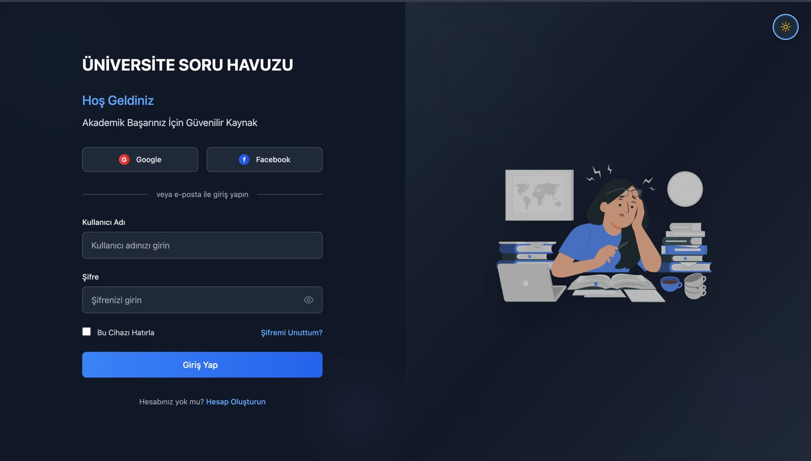
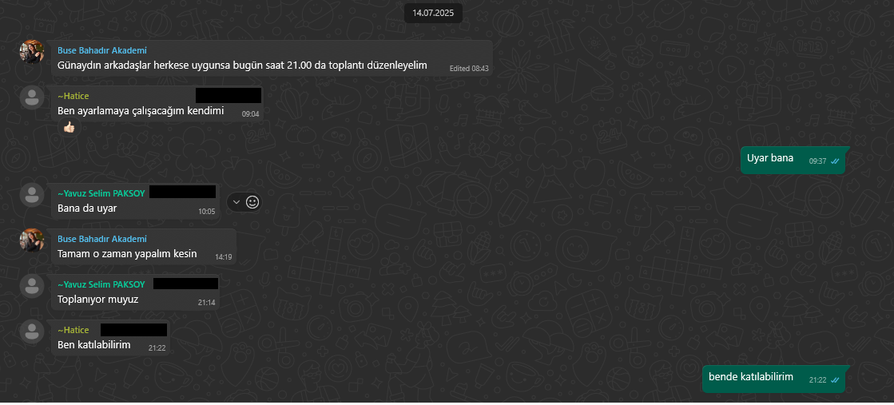
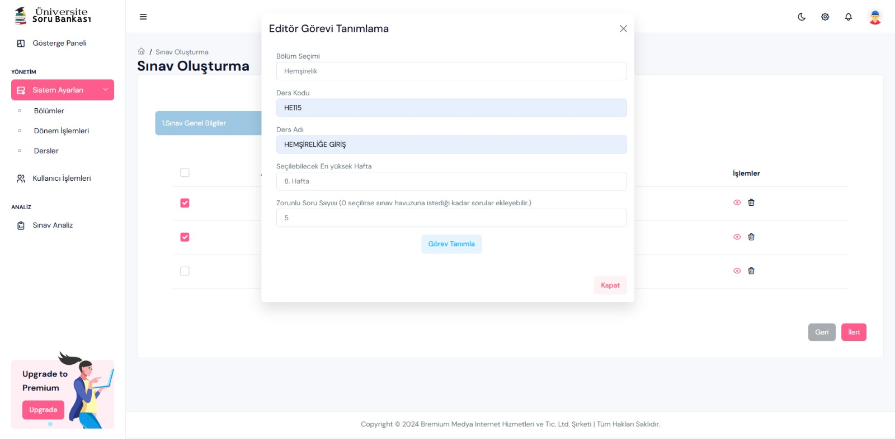
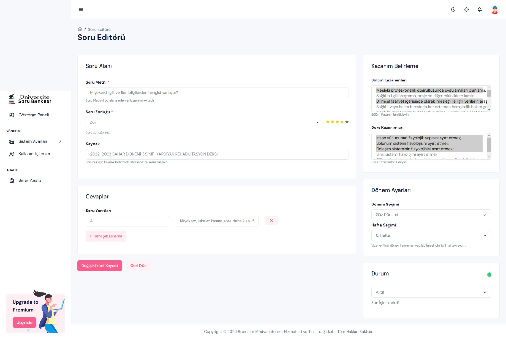
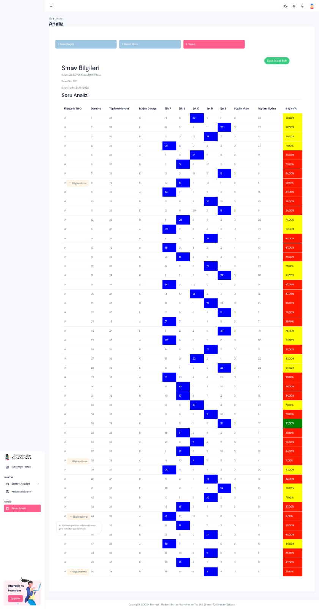

# Üniversite Soru Bankası – Akademik Sınav Yönetim ve Analiz Sistemi

## Takım Bilgileri

**Takım İsmi:** AI-62

### Takım Üyeleri

- Product Owner: Yavuz Selim Paksoy  
- Scrum Master: Umut Can Konukçu  
- Developer #1: Buse Bahadır  
- Developer #2: Hatice Bekdemir  

---

## Proje Hakkında

**Üniversite Soru Bankası**, yükseköğretim kurumlarının sınav hazırlık ve değerlendirme süreçlerini dijital ortama taşıyan bütünleşik bir platformdur. Sistem; sınav planlama, editör görevlendirme, soru havuzu yönetimi ve sınav analiz modüllerini içerir.

Kullanıcılar:

- Sınav oluşturabilir  
- Görevli editörleri belirleyebilir  
- Sorular hazırlayabilir  
- Sınav sonuçlarını analiz edebilir  

---

## Uygulama Özellikleri

### 1. Sınav Yönetimi

- Sınav adı, kodu, tarihi ile adım adım sınav oluşturma
- Editör atama (popup yapıda)
- Validasyon destekli görev formu

### 2. Soru Editörü

- Soru metni, şıklar ve doğru cevap işaretleme
- Zorluk derecesi, kaynak bilgisi, kazanım eşleştirme
- Dönem/hafta bazlı zamanlama
- Aktif/Pasif durumu (toggle switch)

### 3. Sınav Analizi Modülü

- Kitapçık türü, soru numarası, cevap analizleri
- Şık dağılımı ve başarı yüzdesi
- Renkli başarı kutuları:
  - %75 ve üzeri  
  - %50–74  
  - %0–49  
- Filtreleme, sıralama, Excel çıktısı

## Projenin Nihai Hedefi

Bu proje, sınav süreçlerini:

- **Sayısal**,  
- **Objektif**,  
- **Kazanım odaklı** bir yapıya oturtarak;

akademik kaliteyi artırmak ve eğitim çıktılarını izlenebilir hale getirmek için tasarlanmıştır.

Uzun vadede, sınav performansları ile bölüm öğrenim çıktıları arasında **istatistiksel ilişki kurulması** hedeflenmektedir.

---

## Kullanılan Teknolojiler

- **Frontend:** React.js + Tailwind CSS  
- **Backend:** Firebase (Realtime Database, Auth)  
- **Görselleştirme:** Chart.js  
- **Excel Çıktısı:** ExcelJS  
- **Tasarım:** Mobil uyumlu, sade, kurumsal arayüz  

---

## Hedef Kitle

- Üniversite öğretim elemanları  
- Fakülte sınav sorumluları  
- Eğitim teknolojileri birimleri  
- Soru havuzu yöneticileri  
- Dijital sınav altyapısı arayan kurumlar  

---

## Sprint 1

### Sprint Notları

- Projenin vizyonu ve mimarisi oluşturuldu  
- Giriş sistemi (Login Sayfası) geliştirildi  
- Firebase Authentication ile tam entegre  
- Google, Facebook ve e-posta ile giriş desteklendi  

### Planlanan Puan: `100 puan`

### Puanlama Mantığı
Toplamda yaklaşık 300 puanlık bir backlog hazırlanmıştır.  
İlk sprintte planlama ve altyapı kurulumları önceliklendirildiği için hedef 100 puan belirlenmiştir.

### Daily Scrum

> Günlük gelişmeler WhatsApp grubunda yazılı olarak paylaşıldı.

### Sprint Board

### Ürün Durumu

- Giriş ekranı UI/UX tamamlandı  
- Validasyon ve hata uyarıları eklendi  
- Mobil uyumlu yapıya geçildi  
- Şifremi unuttum & hesap oluştur bağlantıları aktif  

### Sprint Review

- Giriş akışı başarıyla çalışıyor  
- Firebase entegrasyonu stabil  
- Sosyal girişler (Google/Facebook) test edildi  
- Masaüstü ve mobil cihazlarda başarıyla test edildi  

### Ekran Görüntüsü

### Retrospective

**İyi Gidenler**
- Net görev tanımı ile hızlı ilerleme  
- Firebase entegrasyonu problemsiz  
- UI tasarımı sade ve etkili  

**Geliştirilebilecek Noktalar**
- UI testleri daha erken başlamalı  
- Figma prototipleri önceden paylaşılmalı  
- Git commit mesajları daha açıklayıcı olmalı  

### Sprint 2'ye Hedefler

- Sınav Oluşturma süreci başlayacak  
- Editör Görev Atama popup geliştirilecek  
- Soru Editörü arayüzü çizilecek  
- Rol tabanlı kullanıcı erişimleri tanımlanacak  

---

## Sprint 2

### Sprint Notları

- Editör Görev Atama, Soru Editörü ve Sınav Oluşturma akışı geliştirildi  
- UI sade ve kurumsal çizgide tutuldu  
- Kullanıcı rollerine göre erişim sistemi planlandı  

### Planlanan Puan: `100 puan`
Sprint 2'de odak, sistemin temel işlevsel modüllerinin geliştirilmesine verilmiştir.
Bu sprint için 100 puanlık görev tanımlanmıştır. Puanlama şu modüllerin kapsamına göre dağıtılmıştır:

Editör Görev Atama (popup form, validasyon): 30 puan
Soru Editörü (tam ekran, tüm bileşenlerle): 40 puan
Sınav Oluşturma Süreci (3 adımlı yapı, yönlendirme akışı): 30 puan

### Daily Scrum

> İletişim yine WhatsApp grubu üzerinden sürdürüldü. UI testleri yapılmaya başlandı.

### Sprint Board  

### Ürün Durumu

####  Editör Görev Atama

- Bölüm, ders kodu, ders adı, hafta ve zorunlu soru alanları  
- Form validasyonu ve açıklama desteği  
- Modal (popup) yapı  
- “Görev Tanımla” ve “Kapat” butonları

####  Soru Editörü

- Soru metni, zorluk derecesi, şıklar  
- Doğru cevap işaretleme  
- Bölüm & ders kazanımı eşleştirme (çoklu seçim)  
- Dönem/hafta ayarı, aktif/pasif toggle  
- “Kaydet” ve “Geri Dön” butonları

####  Sınav Oluşturma Süreci

- 3 adımlı yapı: Sınav Bilgisi > Editör Seçimi > Önizleme  
- Üst akış çizgisiyle yönlendirici deneyim

### Sprint Review

- Görev atama modülü stabil şekilde tamamlandı  
- Soru editörü kullanıcı dostu şekilde genişletildi  
- UI prototipler finalize edilerek yorumlara göre güncellendi  

### Retrospective

**İyi Gidenler**
- UI’da sade ve temiz çizgi  
- Validasyonlar sorunsuz  
- Mobil önizleme başarılı

**Geliştirilebilecek Noktalar**
- Kazanım verileri dinamikleşmeli  
- Şık sayısına alt/üst sınır eklenmeli  
- Sınav sonrası kullanıcı geri bildirimi gösterilmeli  

### Sprint 3'e Hedefler

- Sınav Analiz Sayfası geliştirilecek  
- Rol bazlı erişim tamamlanacak  
- PDF çıktısı ve kullanıcı işlem logları eklenecek  
- Çoklu soru yükleme sistemi araştırılacak  

---
