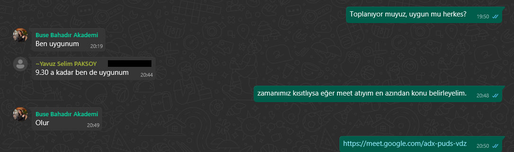
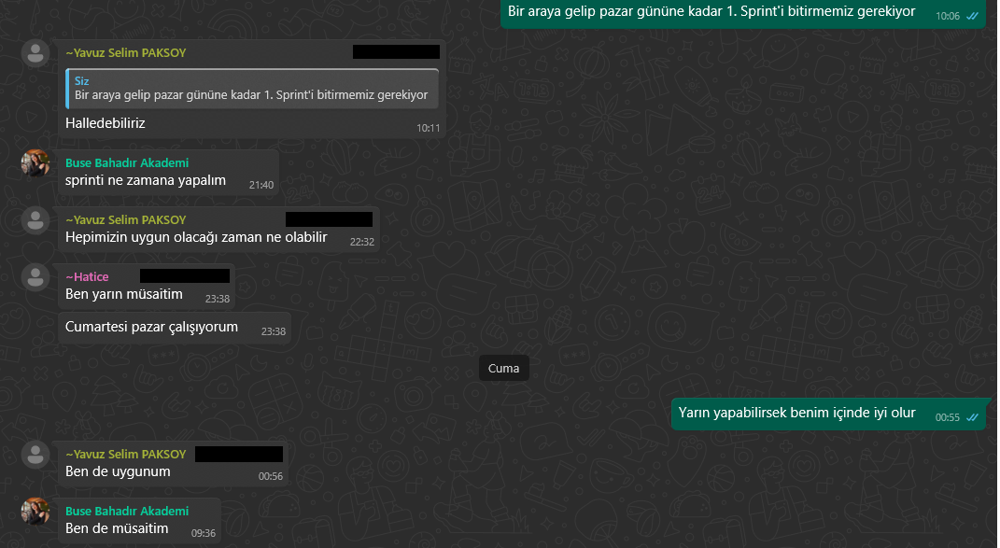

# SleepWise – Yapay Zeka Destekli Uyku Günlüğü ve Kişisel Tavsiye Sistemi

## Takım Bilgileri

**Takım İsmi:** AI-62

### Takım Üyeleri
- Product Owner: Yavuz Selim Paksoy  
- Scrum Master: Umut Can Konukçu
- Developer #1: Buse Bahadır  
- Developer #2: Hatice Bekdemir  

## Proje Hakkında

Üniversite Soru Bankası, yükseköğretim kurumlarının sınav hazırlık ve değerlendirme süreçlerini dijital ortama taşıyan bütünleşik bir platformdur. Sistem; sınav planlama, editör görevlendirme, soru havuzu yönetimi ve sınav analiz modüllerini barındırır. Kullanıcılar arayüz üzerinden sınav oluşturabilir, görevli editörleri belirleyebilir, sorular hazırlayabilir ve sınav sonuçlarını detaylı biçimde analiz edebilirler.

Uygulama Özellikleri
1. Sınav Yönetimi
Sınav adı, kodu ve tarihiyle birlikte sınav oluşturma adımları (Genel Bilgiler, Editör Seçimi, Önizleme)
Görevli editör atama ve editörlerin yetki düzeyini belirleme
Görev atama ekranı popup olarak açılır, validasyon desteklidir

2. Soru Editörü
Soru metni ve şıkların yapılandırıldığı detaylı editör
Zorluk derecesi, kaynak bilgisi ve doğru cevap işaretleme özellikleri
Çoklu kazanım eşleştirme: bölüm kazanımları ve ders kazanımları
Dönem/hafta bazlı sınav tarihi planlaması
Aktif/pasif durumu için hızlı toggle kontrolü

3. Sınav Analizi Modülü
Her bir soru için:
Kitapçık türü, soru numarası, doğru cevap
Şık dağılımları ve boş bırakılan soru sayısı
Toplam doğru sayısı ve başarı yüzdesi
Başarı oranı görsel olarak renklendirilir:

%75 ve üzeri: Yeşil
%50–74: Sarı
%0–49: Kırmızı

“Excel Olarak İndir” özelliği

Tablo üzerinde filtreleme ve sıralama yapılabilir

Üç adımlı üst navigasyon: Sınav Seçimi > Rapor Yükle > Sonuç

**Örnek öneri:**  
"Stres düzeyinizin arttığı günlerde uyku süreniz %20 düşmektedir. Gece rutinlerinizi gözden geçirmeyi deneyebilirsiniz."

Veriler grafiklerle sunulur ve öneriler gerçek zamanlı olarak güncellenir.

## Projenin Nihai Hedefi

Üniversite Soru Bankası projesi, yükseköğretim kurumlarında sınav hazırlama, soru editörlüğü ve sonuç analiz süreçlerini dijitalleştirerek akademik kaliteyi artırmayı hedefleyen bir yönetim sistemidir.
Amaç, sadece soruları toplamak değil; kazanım odaklı, istatistiksel olarak güçlü ve izlenebilir sınav süreçleri tasarlayarak, öğretim elemanlarına veri temelli geri bildirim sunan bir platform oluşturmaktır.

Sistem, editörlerin daha bilinçli soru üretmesini, koordinatörlerin daha etkili görev dağılımı yapmasını ve yöneticilerin sınav kalitesini objektif olarak değerlendirmesini mümkün kılar.
Uzun vadede, her bölümün öğrenim çıktıları ile sınav performansları arasındaki ilişkiyi analiz ederek akademik gelişim için stratejik içgörüler sunmayı amaçlar.

## Kullanılan Teknolojiler
Frontend: React.js + Tailwind CSS
Backend: Firebase (Realtime Database, Authentication)
Görselleştirme: Chart.js
Dosya Çıkışı: ExcelJS
UI: Kurumsal sade tasarım, mobil uyumlu yapı

## Hedef Kitle
-Üniversite öğretim elemanları
-Fakülte sınav sorumluları
-Eğitim teknolojileri birimleri
-Soru havuzu yöneticileri
-Yükseköğretimde dijital sınav altyapısına geçmek isteyen kurumlar

## Sprint 1

### Sprint Notları
Bu ilk sprint, Üniversite Soru Bankası projesinin temelini oluşturmak amacıyla planlanmıştır.
Projenin vizyonu netleştirilmiş, hedef kullanıcı kitlesi belirlenmiş ve teknik mimari ön hazırlıkları yapılmıştır.
Bu sprintte kullanıcıların sisteme güvenli ve kolay bir şekilde giriş yapabilmesini sağlayacak Login Sayfası odak alınmıştır.
UI/UX tasarımı tamamlanan bu ekran, Firebase tabanlı kimlik doğrulama ile entegre edilmiştir.

### Sprint İçinde Tamamlanması Planlanan Puan
100 puan

### Puanlama Mantığı
Toplamda yaklaşık 300 puanlık bir backlog hazırlanmıştır.  
İlk sprintte planlama ve altyapı kurulumları önceliklendirildiği için hedef 100 puan belirlenmiştir.
Login modülü, proje boyunca erişim denetiminin temelini oluşturacağı için öncelikli olarak tamamlanmıştır.

### Daily Scrum
Zaman kısıtları nedeniyle günlük gelişmeler WhatsApp grubunda yazılı olarak paylaşılmıştır.

### Ürün Durumu
-Proje vizyonu ve hedef kitle netleştirildi
-Firebase Authentication ile oturum yönetimi planlandı
-Google, Facebook ve e-posta tabanlı giriş desteği sağlandı
-Giriş ekranı UI/UX tasarımı tamamlandı
-Giriş sayfası mobil uyumlu hale getirildi
-Hatalı girişler için kullanıcı dostu validasyon eklendi
-“Şifremi unuttum” ve “Hesap oluştur” bağlantıları aktif hale getirildi

### Sprint Review
-Kullanıcı arayüzü temiz ve erişilebilir şekilde geliştirildi
-Firebase bağlantısı başarıyla kuruldu
-Giriş senaryoları test edildi: geçersiz e-posta, hatalı şifre, boş alan uyarıları
-Google ve Facebook ile sosyal giriş entegrasyonu tamamlandı
-Masaüstü ve mobil cihazlarda testler başarıyla gerçekleştirildi

### Ürünün Ekran Görüntüleri

### Sprint Retrospective

**İyi Gidenler:**
-Net görev tanımı sayesinde hızlı ilerleme
-Firebase dokümantasyonuna uygun geliştirme
-UI/UX tasarımı sadeliğiyle öne çıktı
-Sosyal medya girişleri başarıyla entegre edildi

**Geliştirilebilecek Noktalar:**
-UI testleri sprintin daha erken safhasında başlamalı
-Prototip ekranlar Figma üzerinden önceden paylaşılmalı
-GitHub commit mesajlarında daha açıklayıcı etiketleme yapılmalı

### İyileştirme Hedefleri (Sprint 2 için)
-Sınav Oluşturma modülünün temelleri atılacak
-Editör Görev Atama ekranı popup şeklinde geliştirilecek
-Soru Editörü ekran tasarımı oluşturulacak
-UI prototipler finalize edilerek paydaşlarla paylaşılacak
-Rol bazlı yetkilendirme için kullanıcı rolleri (admin, editör) tanımlanacak

## Sprint 2
###Sprint Notları
Bu sprintte, sistemin çekirdek işlevleri arasında yer alan Editör Görev Atama, Sınav Oluşturma Süreci ve Soru Editörü modülleri geliştirilmiştir. Kullanıcı rollerine göre erişim yapısı şekillendirilmiş ve arayüz bileşenleri sade, kurumsal çizgide tasarlanmıştır.
Ayrıca UI prototipler finalize edilerek geri bildirimler doğrultusunda revize edilmiştir.

### Sprint İçinde Tamamlanması Planlanan Puan
100 puan

### Puanlama Mantığı
Backlog toplamı 300+ puana genişletilmiştir. Sprint 2’de 100 puanlık görev, kullanıcı tarafındaki aktif modüllerin prototip ve işlevsel entegrasyonlarını kapsayacak şekilde seçilmiştir.
Odak: Editör yönetimi, sınav süreci başlatma ve soru üretimi ekranları.

### Daily Scrum
Zaman kısıtları nedeniyle günlük gelişmeler WhatsApp grubunda yazılı olarak paylaşılmıştır.

### Ürün Durumu
##Editör Görev Atama Sayfası
-Bölüm, Ders Kodu, Ders Adı, En Yüksek Hafta, Zorunlu Soru Sayısı alanları
-Form validasyonu: boş alan, sayı sınırı ve açıklama desteği
-“Görev Tanımla” ve “Kapat” butonları
-Sayfa, popup/modal olarak açılır yapıdadır
-UI sade ve beyaz arka planla tasarlandı

##Soru Editörü
-Soru metni girişi
-Zorluk derecesi (Kolay / Orta / Zor)
-Şık ekleme ve açıklama yazma desteği
-Doğru cevap işaretleme
-Kazanım eşleştirme (Bölüm ve Ders kazanımları – çoklu seçim)
-Dönem ve hafta seçimi
-Aktif / pasif durumu (toggle)
-“Değişiklikleri Kaydet” ve “Geri Dön” butonları

### Sprint Review
-Görev atama ekranı, validasyonlarla birlikte başarıyla geliştirildi
-Soru editörü kullanıcı odaklı ve esnek hale getirildi
-Kazanım eşleştirme sayesinde pedagojik kontrol sağlandı
-Sınav oluşturma süreci yönlendirici akışla netleştirildi
-Modal tasarımlar kullanıcı deneyimini sadeleştirdi

### Ürünün Ekran Görüntüleri

### Sprint Retrospective

**İyi Gidenler:**
-UI tasarımlarında sade, kurumsal çizgi yakalandı
-Validasyon kontrolleri başarılı şekilde uygulandı
-Geliştirme süreci net görev ayrımıyla ilerledi
-Mobil önizlemelerde kararlı yapı sağlandı

**Geliştirilebilecek Noktalar:**
-Kazanım verileri için dinamik veri tabanı entegrasyonu yapılmalı
-Şıklar bölümüne minimum–maksimum sınırlandırması getirilmeli
-Sınav kaydı sonrası geri bildirim ekranı geliştirilmeli

### İyileştirme Hedefleri (Sprint 3 için)

-Sınav Analiz Sayfası geliştirilecek (renkli başarı kutuları, filtreleme, Excel çıktısı)
-Rol bazlı erişim tam olarak devreye alınacak (admin, editör, sınav koordinatörü)
-PDF çıktısı üretimi test edilecek
-Kullanıcı işlem geçmişi loglanacak
-Çoklu soru yükleme özelliği (batch mode) araştırılacak
