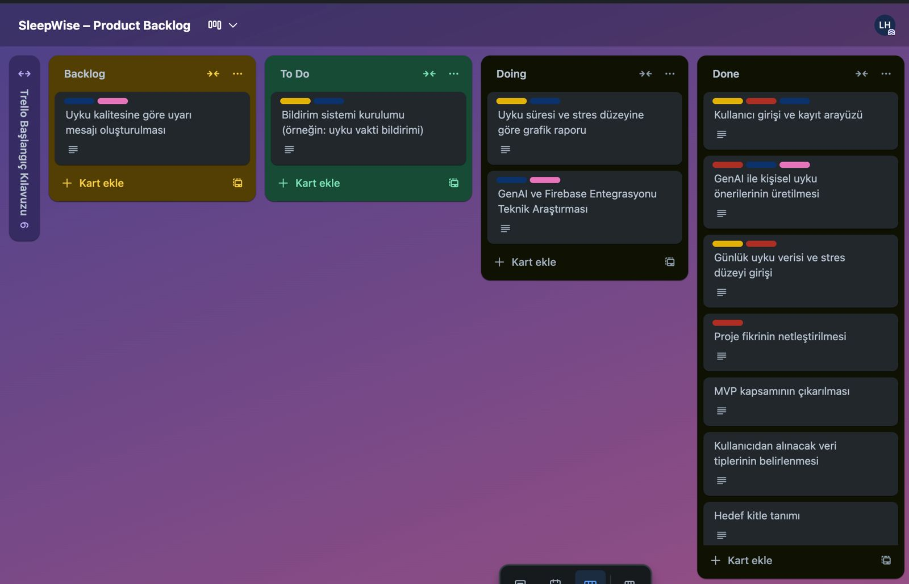
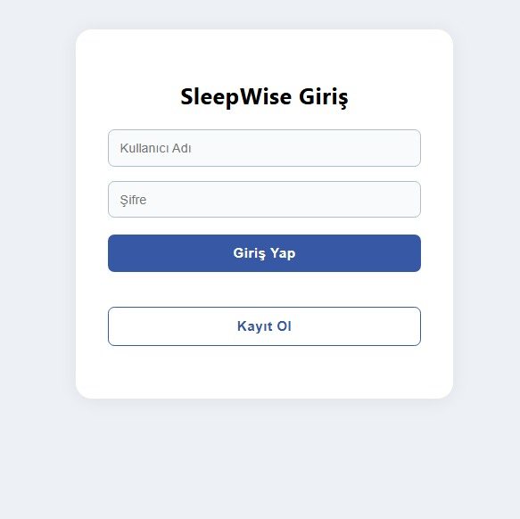
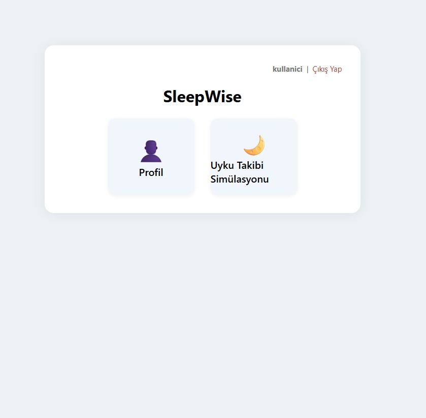
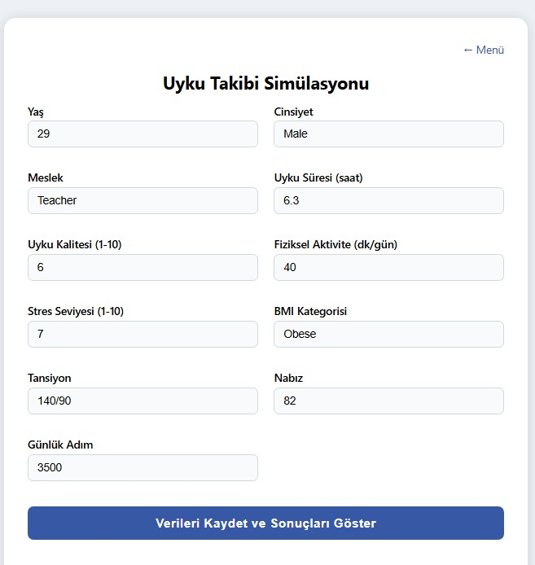
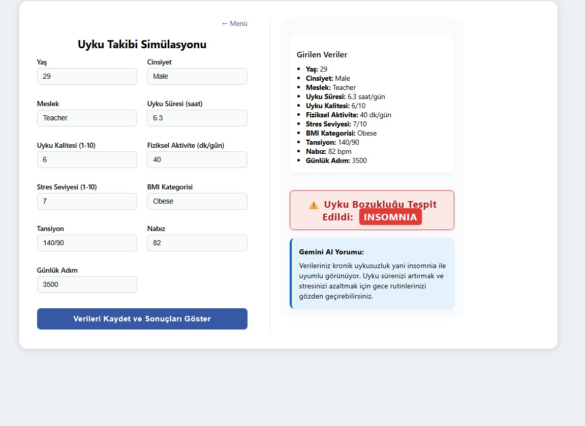

# SleepWise – Yapay Zeka Destekli Uyku Günlüğü ve Kişisel Tavsiye Sistemi

## Takım Bilgileri

**Takım İsmi:** AI-62

### Takım Üyeleri
- Product Owner: Yavuz Selim Paksoy  
- Scrum Master: Umut Can Konukçu
- Developer #1: Buse Bahadır  
- Developer #2: Hatice Bekdemir  

## Proje Hakkında

SleepWise, sadece uyku süresini kaydeden bir uygulama olmanın ötesine geçerek, kullanıcıların uyku alışkanlıklarını analiz etmeye ve iyileştirmeye odaklanan kişiselleştirilmiş bir sağlık teknolojisidir.

Uygulama, kullanıcıdan günlük olarak aşağıdaki yapılandırılmış verileri toplar:
- Uyku süresi
- Stres seviyesi
- Fiziksel aktivite düzeyi
- Ekran süresi
- Kafein tüketimi
- Duygudurum
- Nabız, tansiyon, adım sayısı

Bu veriler Firebase üzerinde saklanır ve yapay zeka desteğiyle analiz edilir. Analiz sonuçları üzerinden GenAI (Google Gemini) tarafından kişiselleştirilmiş öneriler sunulur.

**Örnek öneri:**  
"Stres düzeyinizin arttığı günlerde uyku süreniz %20 düşmektedir. Gece rutinlerinizi gözden geçirmeyi deneyebilirsiniz."

Veriler grafiklerle sunulur ve öneriler gerçek zamanlı olarak güncellenir.

## Projenin Nihai Hedefi

SleepWise’in amacı, uyku problemleri yaşayan bireyler için veri destekli, kişiselleştirilmiş bir rehberlik sistemi oluşturmaktır.  
Uygulama; uyku alışkanlıklarını analiz eden, yapay zeka ile çalışan, kullanıcıya sürekli geri bildirim veren bir dijital sağlık asistanı işlevi görür.

## Uygulama Arayüzü

Uygulamanın ilk sürümünde geliştirilen ekranlar:

- Kullanıcı Girişi ve Kayıt Olma Sayfası  
- Ana Menü (Profil ve Uyku Takibi seçenekleri)  
- Uyku Takibi Simülasyonu:  
  Kullanıcının yaş, cinsiyet, meslek, uyku süresi, stres düzeyi, nabız, tansiyon vb. verileri girdiği ekran  
- Sonuç Ekranı:  
  - Girilen verilerin özetlendiği panel  
  - Uyku bozukluğu tespiti (örneğin: insomnia)  
  - GenAI tarafından oluşturulan kişisel öneriler  

## Özellikler

### Kişiselleştirilmiş Veri Toplama
- Günlük kısa ve yapılandırılmış sorular
- Uyku süresi ve kalitesi
- Stres seviyesi
- Fiziksel aktivite düzeyi
- Ekran süresi
- Duygudurum
- Kafein tüketimi
- Nabız, tansiyon, adım sayısı

### Yapay Zeka Destekli Analiz ve Öneri
- Uyku alışkanlıklarının analizi
- Geçmiş verilere göre kişisel öneriler
- Olası riskli durumlarda uyarılar
- Yaşam tarzı ile uyku arasındaki ilişkilerin tespiti

### Kullanıcı Dostu Arayüz
- Hızlı ve yapılandırılmış veri girişi
- Gerçek zamanlı analiz
- Görsel geri bildirim ve sade sonuç ekranları

## Kullanılan Teknolojiler

- Frontend: React.js  
- Backend: Firebase (Authentication & Realtime Database)  
- LLM: Google Gemini (LangChain ile)  
- Veri Görselleştirme: Chart.js  
- Dataset: Kaggle – Sleep Health and Lifestyle Dataset  

## Hedef Kitle

- Uyku problemi yaşayan çalışanlar  
- Üniversite öğrencileri  
- Sağlıklı yaşam odaklı bireyler  
- Dijital sağlık uygulamalarını aktif kullanan kullanıcılar  
- İkincil hedef: Uyku terapistleri, psikologlar, danışmanlar  

## Sprint 1

### Sprint Notları
Bu ilk sprint, SleepWise projesinin temelini oluşturmak üzere planlanmıştır.  
Projenin vizyonu netleştirilmiş, MVP kapsamı belirlenmiş ve teknik ön hazırlıklar yapılmıştır.  
Kullanıcıdan toplanacak veriler yapılandırılmış, öneri sistemi için yapay zeka planlaması yapılmıştır.

### Sprint İçinde Tamamlanması Planlanan Puan
100 puan

### Puanlama Mantığı
Toplamda yaklaşık 300 puanlık bir backlog hazırlanmıştır.  
İlk sprintte planlama ve altyapı kurulumları önceliklendirildiği için hedef 100 puan belirlenmiştir.

### Daily Scrum
Zaman kısıtları nedeniyle günlük gelişmeler WhatsApp grubunda yazılı olarak paylaşılmıştır.

### Sprint Board

### Ürün Durumu
- Proje vizyonu ve kullanıcı değeri netleştirildi  
- Uyku ile ilişkili veri alanları yapılandırıldı  
- Genel uygulama akışı planlandı  
- Yapay zeka algoritması ve LLM altyapısı araştırıldı  
- Uygulama arayüzünün ilk versiyonları tasarlandı ve geliştirildi  
- Uyku Takibi Simülasyon Ekranı tamamlandı  
- Sonuç ekranında uyku bozukluğu tespiti ve GenAI önerisi sunulabiliyor  

### Sprint Review
- Ürün fikri kullanıcı gereksinimlerine göre tanımlandı  
- Veri yapısı oluşturuldu  
- Uyku bozukluğu tespiti ekranı geliştirildi  
- GenAI ile öneri üretimi başlatıldı  
- Kullanıcı arayüzü temel düzeyde çalışır durumda  

### Ürünün Ekran Görüntüleri

### Sprint Retrospective

**İyi Gidenler:**
- Vizyon netliği ve ekip içi motivasyon
- Yapılandırılmış veri yapısı
- Başarılı ekran geliştirme ve test çıktısı
- LLM ile ilk entegrasyon denemeleri

**Geliştirilebilecek Noktalar:**
- Ekip içi görev dağılımı daha netleştirilmeli  
- UI geliştirme süreçleri daha erken başlamalı  
- Daily Scrum süreçleri daha aktif yürütülmeli  

### İyileştirme Hedefleri (Sprint 2 için)
- Wireframe ve UI prototip tamamlanacak  
- GenAI öneri motoru genişletilecek  
- Backend API bağlantısı tamamlanacak  
- Kullanıcı senaryoları tanımlanacak ve test edilecek  

 
